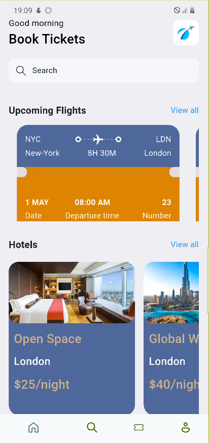
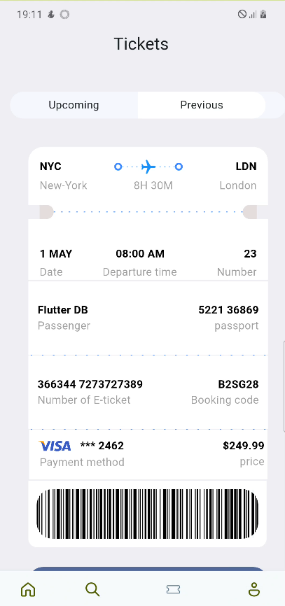
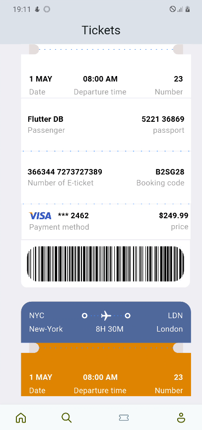
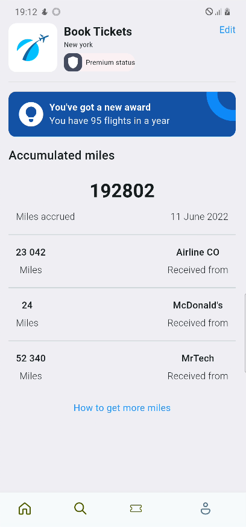
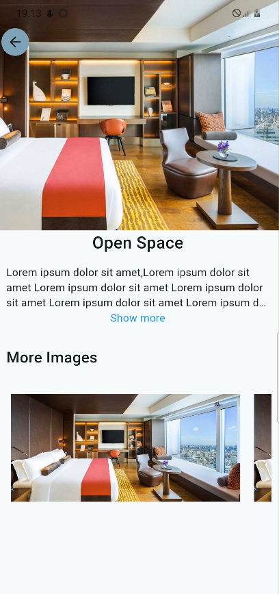

# ✈️ Ticket Booking App (Flutter)

A **Flutter UI design** for a Ticket Booking application.  
This project focuses on creating a **beautiful, responsive UI** for flight and hotel booking, without any backend integration.  

---

## 📸 App UI Preview

  
  
  

  
  
  

  

---

## 🚀 Features
- 🏠 **Home View** – Browse upcoming flights, hotel details, and ticket information  
- ✈️ **Flights Section** – Display available flight options  
- 🏨 **Hotels Section** – View hotel details and booking information  
- 🎟️ **Tickets Section** – Check ticket details and status  
- ⚡ **State Management with GetX** – Simple and efficient reactive state management  

---

## 🛠️ Built With
- [Flutter](https://flutter.dev/) – UI toolkit for building cross-platform apps  
- [GetX](https://pub.dev/packages/get) – State management, navigation & dependency injection  

---

## 📂 Project Structure
